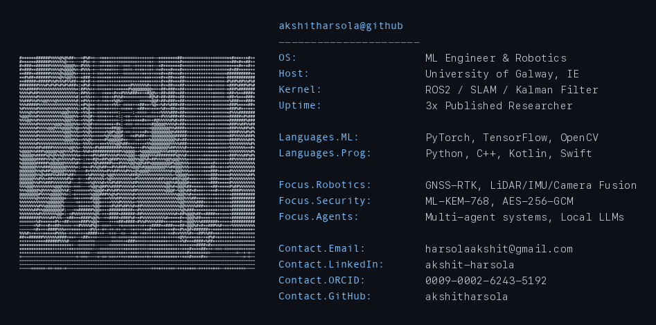

<!-- HEADER -->

  

<!-- PROFILE VIEWS -->

  

<!-- TYPING ANIMATION -->

  

 

---

## 👋 About Me

  

 

---

## 🛠️ Tech Stack

**Languages**

  

**ML · Robotics · Vision**

  

**Backend · Infra · Tools**

  

**Mobile & Frontend**

 

---

## 📊 Profile Summary

  

  
  
  

 

---

## 🚀 Featured Projects

<table>
<tr>
<td width="50%">

### 🦾 Autonomous Agricultural Robotics (In Progress)
> Intelligent Robotics Major Project · University of Galway

- Autonomous strawberry harvesting robot with **multi-sensor fusion** (LiDAR, IMU, camera, GNSS-RTK)
- 50+ sensor readings/second · **95% localization accuracy**
- ROS2 + Kalman filtering with RTK-GPS — position drift **< 2cm** over 100m
- Reduced manual intervention by **70%** in field trials

</td>
<td width="50%">

### 👁️ [AutoVision — Automated Object Annotation](https://github.com/akshitharsola/AutomationIMG)
> Automated object annotation pipeline — Python · OpenCV · CNN · 60% annotation time reduction

- Reduced annotation time by **60%** (5h → 2h per 100 images)
- Data augmentation pipeline generating **2,000+ synthetic samples**
- **15% robustness improvement** across diverse lighting conditions
- False positives reduced from 18% to 9%

</td>
</tr>
<tr>
<td width="50%">

### 🔐 [Secure Vault](https://github.com/akshitharsola/Secure-Vault)
> Quantum-resistant Android password manager

- **AES-256-GCM + ML-KEM-768** hybrid post-quantum crypto
- Hardware TEE/Secure Element — keys never leave the chip
- Biometric auth · tamper detection · clipboard auto-clear
- **Zero internet** permissions — 100% offline

</td>
<td width="50%">

### 🤖 [Samay](https://github.com/akshitharsola/Samay)
> Multi-Agent AI Session Manager · 6 architectures

- Persistent sessions: Claude · Gemini · Perplexity
- Anti-bot fingerprint spoofing + human-like patterns
- Chrome Extension **MV3** zero-cost architecture (v6)
- Automated OTP via **Gmail API**

</td>
</tr>
</table>

 

---

## 📰 Research Publications

| Year | Paper | Journal |
|:--|:--|:--|
| Apr 2025 | Micro-Expression Recognition for Lie Detection Using Image Processing | Int. Journal of Science, Engineering & Technology |
| Feb 2024 | Integrating Blockchain and 5G Technologies for Enhanced Edge Computing | Int. Journal of Recent Advances in Multidisciplinary Topics |
| Jan 2024 | Utilizing AlphaFold Predictions to Understand Protein Function and Dynamics | Int. Research Journal of Modernization in Engineering Technology |

 

---

## 📈 GitHub Stats

  
  

 

  

 

---

## 📉 Activity Graph

  

 

---

## 🐍 Contribution Snake

  

 

---

## 🔗 Let's Connect

 

<!-- FOOTER -->

  

  Made with ❤️ by <a href="https://github.com/akshitharsola">Akshit Harsola</a> &amp; <a href="https://claude.ai">Claude</a>

